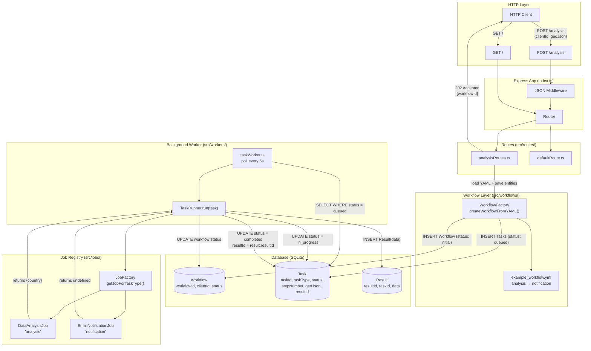
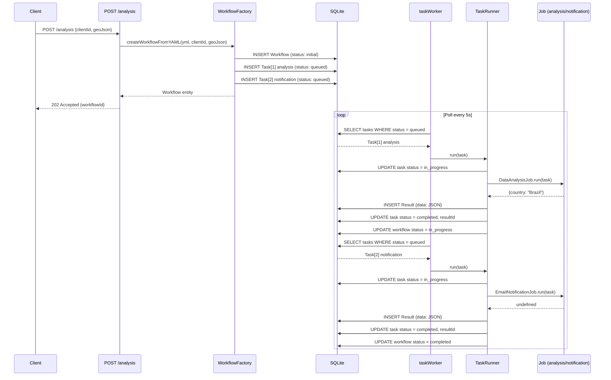
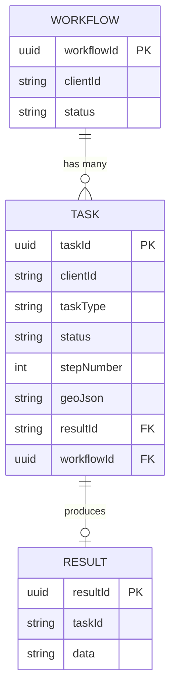
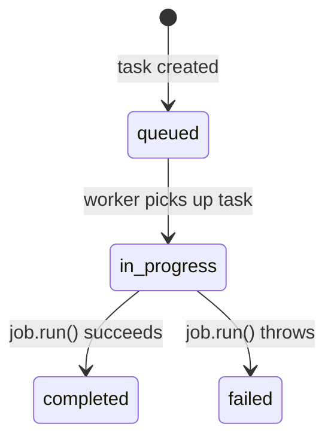
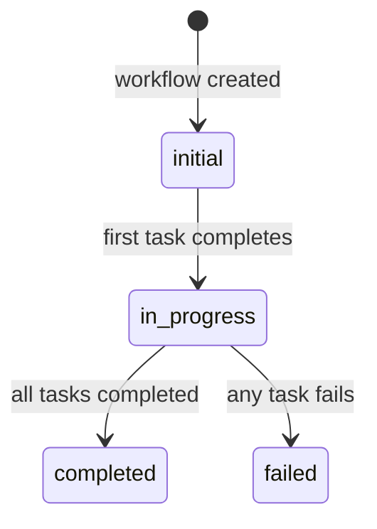

# Server Architecture

## Overview

An Express.js backend that accepts geospatial analysis requests and executes them asynchronously through a YAML-driven workflow engine. Tasks are persisted in SQLite and processed by a background polling worker.

---

## System Architecture Diagram

---

## Request Lifecycle

---

## Entity Relationships

---

## Component Map

| Layer | File | Responsibility |
|---|---|---|
| Entry | [src/index.ts](../src/index.ts) | Bootstraps Express, registers routes, starts worker |
| Config | [src/config.ts](../src/config.ts) | Validates env vars with Zod |
| Database | [src/data-source.ts](../src/data-source.ts) | TypeORM DataSource (SQLite, synchronize: true) |
| Route | [src/routes/analysisRoutes.ts](../src/routes/analysisRoutes.ts) | `POST /analysis` — triggers workflow creation |
| Route | [src/routes/defaultRoute.ts](../src/routes/defaultRoute.ts) | `GET /` — renders README.md as styled HTML |
| Entity | [src/models/Workflow.ts](../src/models/Workflow.ts) | Workflow DB entity (groups tasks) |
| Entity | [src/models/Task.ts](../src/models/Task.ts) | Task DB entity (single unit of work) |
| Entity | [src/models/Result.ts](../src/models/Result.ts) | Result DB entity (stores job output JSON) |
| Workflow | [src/workflows/WorkflowFactory.ts](../src/workflows/WorkflowFactory.ts) | Parses YAML → creates Workflow + Task rows |
| Worker | [src/workers/taskWorker.ts](../src/workers/taskWorker.ts) | Infinite polling loop — picks up queued tasks |
| Worker | [src/workers/taskRunner.ts](../src/workers/taskRunner.ts) | Executes a single task, manages status transitions |
| Job | [src/jobs/JobFactory.ts](../src/jobs/JobFactory.ts) | Maps `taskType` string → `Job` instance |
| Job | [src/jobs/DataAnalysisJob.ts](../src/jobs/DataAnalysisJob.ts) | Geospatial containment check via Turf.js |
| Job | [src/jobs/EmailNotificationJob.ts](../src/jobs/EmailNotificationJob.ts) | Simulated email notification (500ms delay) |

---

## Status State Machines

### Task Status

### Workflow Status

---

## Adding a New Job

1. Create `src/jobs/MyJob.ts` implementing the `Job` interface
2. Register it in `src/jobs/JobFactory.ts` under a new `taskType` key
3. Reference the `taskType` in a YAML workflow definition
